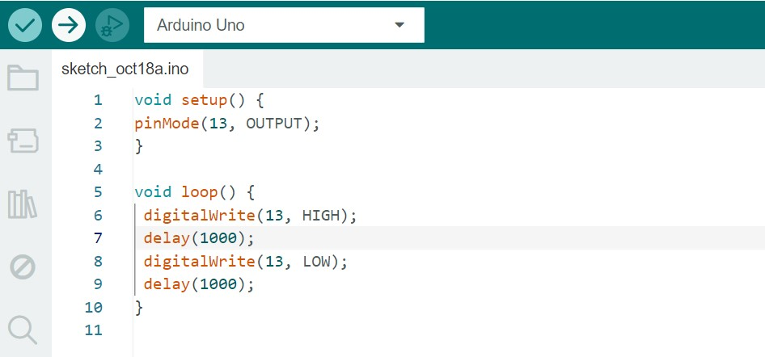

## Ponderada 1: Projeto Arduino - Blink LED

Aluna: Júlia Alves de Jesus | Turma: 14 | Professor: Victor Hayashi 

Esse é o projeto da **Ponderada 1 de Programação**, que inclui duas partes: o Blink do LED interno do Arduino e a simulação de um Blink externo no Tinkercad. Além disso, há um adicional com a montagem física utilizando um protoboard.

### Parte 1: Blink LED Interno

Nesta primeiro parte o que fiz foi testar o Blink no LED interno do Arduino Uno. O LED acende e apaga baseado no delay definido.

#### Imagem do Arduino IDE com o código utilizado:



#### Vídeo do arduino físico funcionando com o código:

<video width="420" height="440" controls>
  <source src="video-parte1-ponderada.mp4" type="video/mp4">
</video>

### Parte 2: Simulação do Blink Externo no Tinkercad

Nesta parte, realizei uma simulação de LED externo piscando, resistor de 1KΩ e Arduino Uno com um protoboard no Tinkercad. Setei o delay para 500ms, assim o LED recebe energia máxima através da função DigitalWrite no pino que o mesmo está conectado (em série com o resistor)

### Código utilizado para a simulação no Tinkercad
```cpp
void setup() { // Essa função serve para que o pino 13 seja configurado como saída
  pinMode(13, OUTPUT); // Define como saída o pino 13 do arduino
}

void loop() { // Função que permite que o código fique "rodando" continuamente, repetidamente
  digitalWrite(13,HIGH); // Liga o LED
  delay(500); // Comando de delay, para esperar 500ms
  digitalWrite(13,LOW); // Desliga o LED
  delay(500); // Comando de delay, para esperar 500ms
}
```

### Projeto no Tinkercad: [clique aqui!](https://www.tinkercad.com/things/bpWbTujxiLW/editel?sharecode=4yHk3sOo9T2pa2B8Dpc1ia3Z4UgAnpgbq7VeMp8QcJ0)

### Vídeo da Simulação: 
<video width="420" height="440" controls>
  <source src="video-parte2-ponderada.mp4" type="video/mp4">
</video>


### Parte 3 ("Indo além"): circuito Blink Externo no Protoboard Físico
Por fim, montei o circuito físico utilizando um protoboard, LED, resistor (1kΩ) e Arduino Uno.

O código utilizado foi o mesmo da simulação do Tinkercad.

### Vídeo de demonstração: 
<video width="420" height="440" controls>
  <source src="video-parte3-ponderada.mp4" type="video/mp4">
</video>
